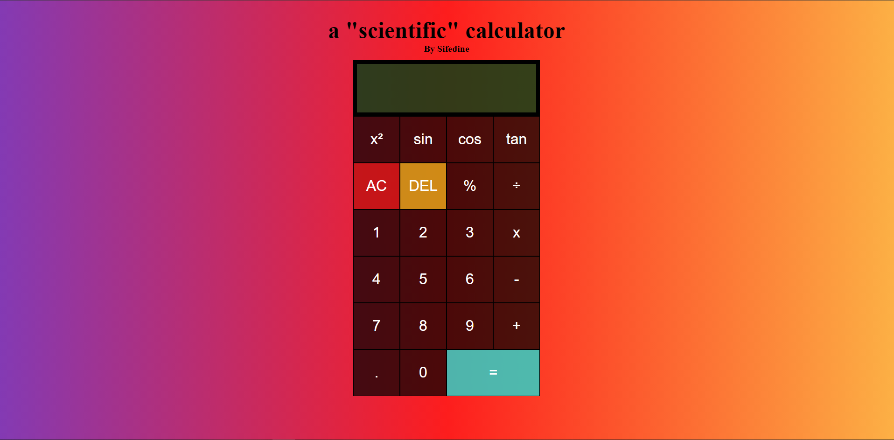

# calculator Project

by Sifedine Hajji

## What ?

The work consists in the creation of a calculator in javascript by following the steps of the repository: [becodeorg/bxl-hopper-1-25](https://github.com/becodeorg/bxl-hopper-1-25/tree/master/The%20Hill/projects/1.calculator).

## When did i work on it ?

The work was given on Monday 16th November and i finished it on wednesday 18th.

## **Functionalities :**

- Simple calculation ( +, -, x, ÷ ).
- Hitory of previus operations.
- a few 'Scientific' Operations ( x², sin(), cos(), tan() ).
- Conversion into percentage (%).

### **Functionalities that need improvements :**

- the operators can be spotted
- the 'scientific' operators applies only to a number and not to an operation.

## What does it look like ?

Here is the direct link to the project i made [My calculator](https://sifedine-hajji.github.io/Scientific-calculator/./).

#### project screenshot :

## How I Proceeded ?

It's the first time I code a calculator in javascript and I didn't know where to start for the visual so I took inspiration from a [Youtube video](https://www.youtube.com/watch?v=JDiurjhpOXA&t=462s) for the visual (css).

Then for Javascript I proceeded as my [collection project](https://github.com/Sifedine-Hajji/Collection) to transcribe my Html in to javascript and for the functionalities of my scientific calculator I looked for help on the internet when I was blocked and I was also helped by colleagues on some points.

## License

© Hajji Sifedine
